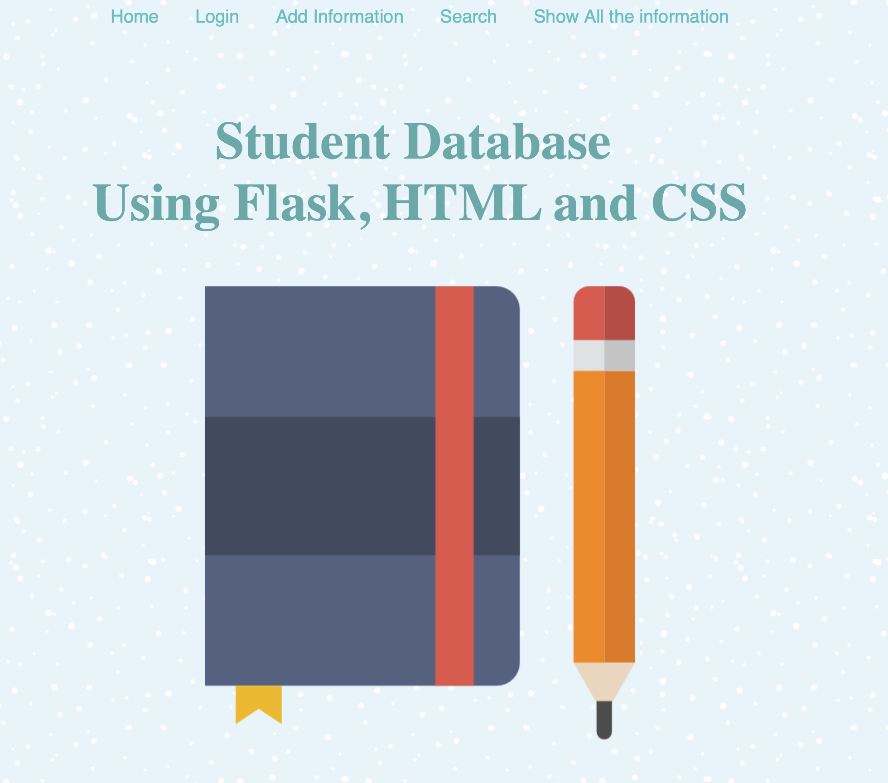

# Flask_App1
## A Basic web application to connect flask with database.

### Objective
The goal of this application is to use the Flask framework of python and make basic database application where user can do following operations:

1. Login using username and password
2. Search for the information
3. Look all the information in database
4. Add a information in database

All forms are connected to info_db. If user's information is in database only then user can login.

### ScreenShots

